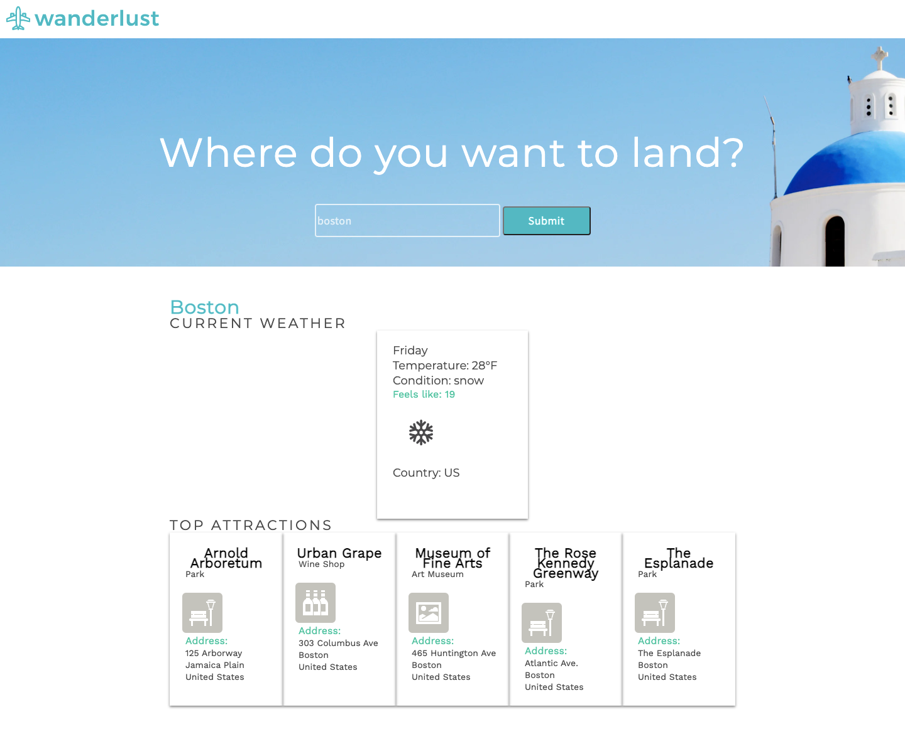

# Wanderlust
Wanderlust allows a user to search for any location and returns the current weather of the location and random places in that area that might be of interest

## Link to project: 
https://place2b.netlify.app/

## How It's Made:
Tech used: HTML, CSS, JavaScript & Jquery

## How it works
This web app utilizes promise API to fetch data from open weather and four square API

## How to use it 
Search for a location and the web app returns the current weather and some places that might be of interest such as restaurants, parks and more...
